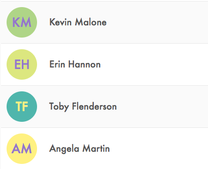

# Unavatar

This is a simple React component to create default avatars for your users / customers / whatever.

[Click here for a simple demo](http://soska.github.io/unavatar/docs/index.html)



## How to use

Just pass a string to the name property to the `Unavatar` component and it will display a nice circular avatar with the name initials and a color chosen from a predefined palette.

```javascript
import Unavatar from 'unavatar';

class App extends React.Component {
  render() {
    return (
      <div>
        <Unavatar name="Armando Sosa" />
        <span>Armando Sosa</span>
      </div>
    );
  }
}
```

## Installation

```
$ yarn add unavatar

or

$ npm install --save unavatar
```

## Uniqueness

The name property is hashed and then used to select a background and text color from the color palette. If you want to improve the uniqueness of the avatar, you can pass an id property to be used instead of the name.

```javascript
import Unavatar from 'unavatar';

class App extends React.Component {
  render() {
    return (
      <div>
        {customers.map(({name,id,company})=>(
          <Unavatar name={name} id={id}/>
          <span>{name}</span>, <span>{company}</span>
        ))}
      </div>
    );
  }
}
```

## Color Palette

By default, `Unavatar` will get the colors from a palette inspired by [Material Design](https://material.io/) but you can pass an array of hex colors to the `palette` property to use that instead. This package comes with other built-in palettes that you can see [in the demo](http://soska.github.io/unavatar/docs/index.html).

```javascript
import Unavatar, { startupPalette } from 'unavatar';

class App extends React.Component {
  render() {
    return (
      <div>
        {customers.map(({ name, id }) => (
          <Unavatar name={name} palette={startupPalette} />
        ))}
      </div>
    );
  }
}
```

You can use a color schema that matches your branding!

```javascript
import Unavatar from 'unavatar';

const myBrandingPalette = [
  '#ff0000',
  '#ffff00',
  '#00ffff',
  '#0000ff',
  '#b4d455',
];

class App extends React.Component {
  render() {
    return (
      <div>
        {customers.map(({ name, id }) => (
          <Unavatar name={name} palette={myBrandingPalette} />
        ))}
      </div>
    );
  }
}
```
